# java调用openoffice

## 概述

并不是所有的项目都是springboot项目，下面将不使用springboot项目来调用openoffice服务


## docx转pdf

### 第一步：新建maven项目

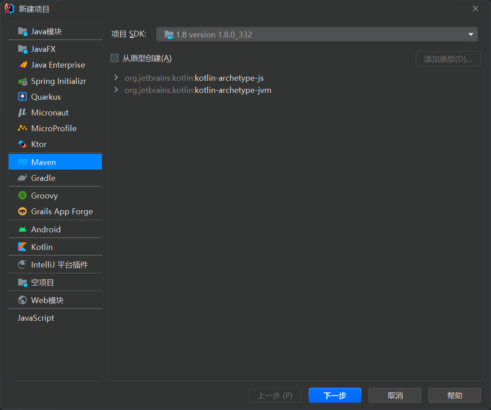


这里项目名称为`openoffice-word-to-pdf2`


### 第二步：配置maven

依赖如下：

```xml
<dependencies>
        <dependency>
            <groupId>org.openoffice</groupId>
            <artifactId>juh</artifactId>
            <version>4.1.2</version>
        </dependency>
        <dependency>
            <groupId>org.openoffice</groupId>
            <artifactId>jurt</artifactId>
            <version>4.1.2</version>
        </dependency>
        <dependency>
            <groupId>org.openoffice</groupId>
            <artifactId>ridl</artifactId>
            <version>4.1.2</version>
        </dependency>
        <dependency>
            <groupId>org.openoffice</groupId>
            <artifactId>unoil</artifactId>
            <version>4.1.2</version>
        </dependency>
        <dependency>
            <groupId>com.artofsolving</groupId>
            <artifactId>jodconverter</artifactId>
            <version>2.2.2</version>
        </dependency>
    </dependencies>
```


jodconverter需要单独下载，因为中央仓库里没有

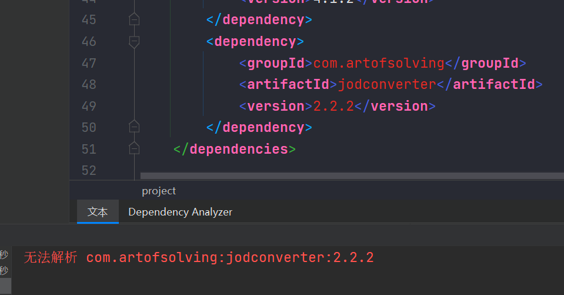


下载地址：https://sourceforge.net/projects/jodconverter/files/


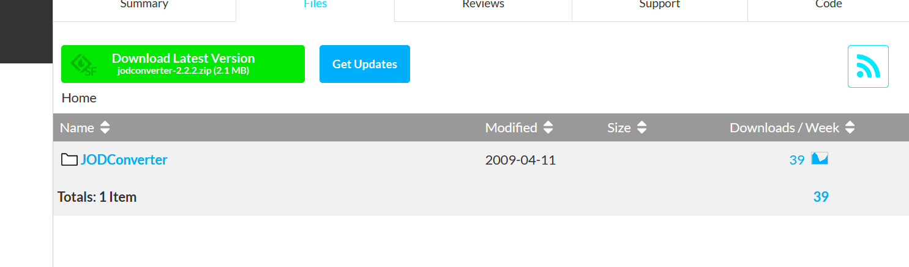


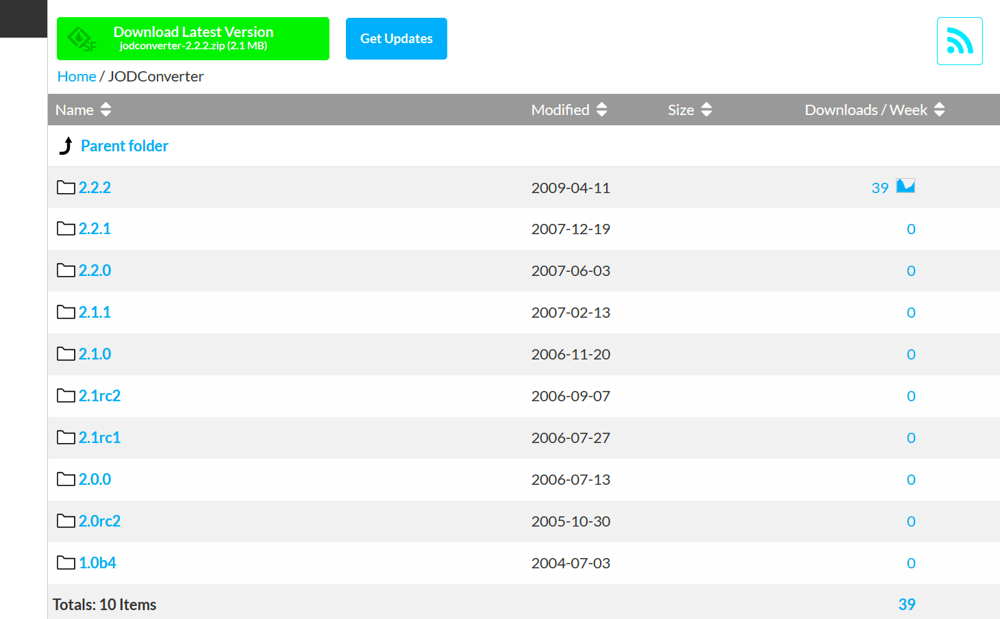


点击2.2.2版本

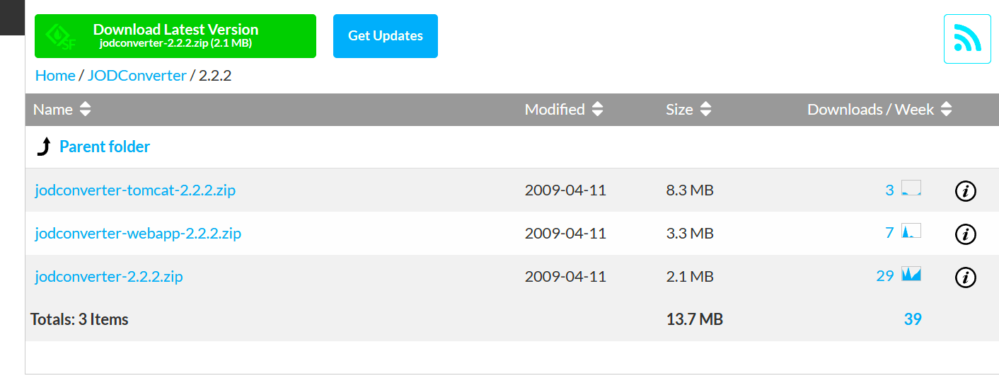


下载：[jodconverter-2.2.2.zip](https://sourceforge.net/projects/jodconverter/files/JODConverter/2.2.2/jodconverter-2.2.2.zip/download)


下载完成后，解压，可以得到这样的目录：

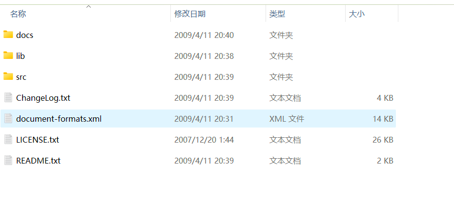


在lib目录下运行：

```sh
mvn install:install-file -Dfile="jodconverter-2.2.2.jar" -DgroupId=com.artofsolving -DartifactId=jodconverter -Dversion=2.2.2 -Dpackaging=jar
```


或者将lib目录拷贝到项目目录下

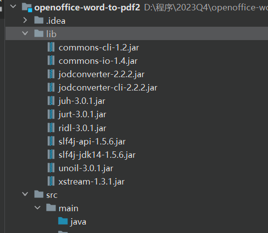


然后再打开项目结构

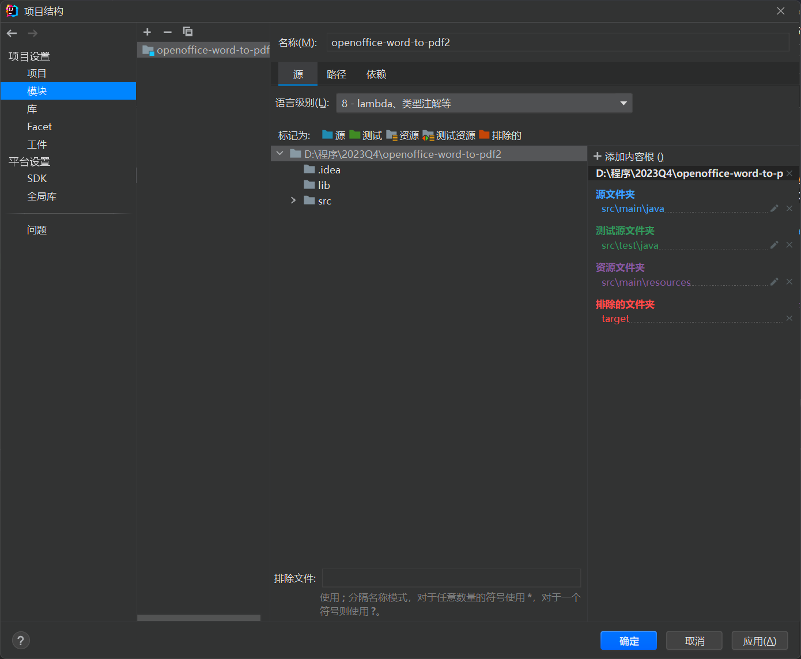


选择库

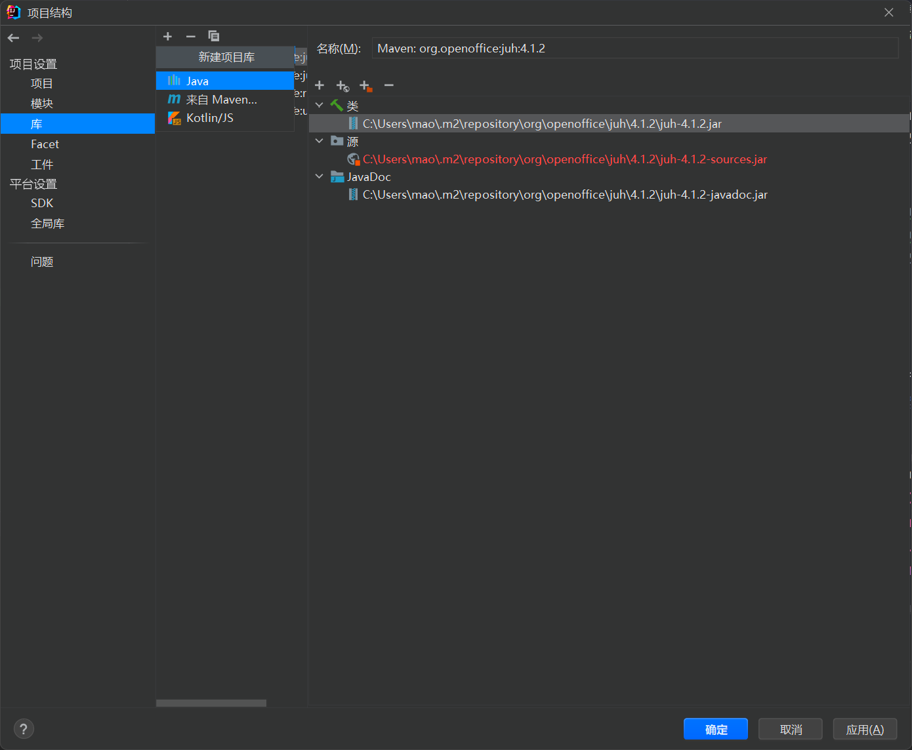


点击新建，选择lib包目录

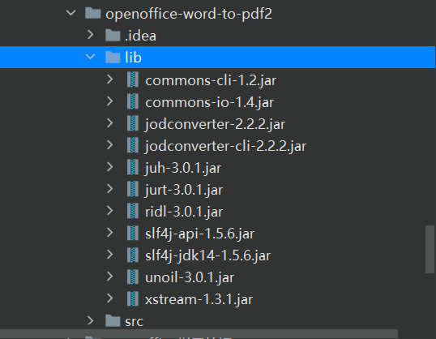


### 第三步：编写DocumentConverterUtil

```java
package mao;

import com.artofsolving.jodconverter.DefaultDocumentFormatRegistry;
import com.artofsolving.jodconverter.DocumentConverter;
import com.artofsolving.jodconverter.DocumentFormat;
import com.artofsolving.jodconverter.openoffice.connection.SocketOpenOfficeConnection;
import com.artofsolving.jodconverter.openoffice.converter.StreamOpenOfficeDocumentConverter;

import java.io.File;
import java.io.IOException;
import java.io.InputStream;
import java.io.OutputStream;
import java.net.ConnectException;
import java.util.Properties;

/**
 * Project name(项目名称)：openoffice-word-to-pdf2
 * Package(包名): mao
 * Class(类名): DocumentConverterUtil
 * Author(作者）: mao
 * Author QQ：1296193245
 * GitHub：https://github.com/maomao124/
 * Date(创建日期)： 2023/11/24
 * Time(创建时间)： 23:53
 * Version(版本): 1.0
 * Description(描述)： 文档转换工具
 */

public class DocumentConverterUtil
{
    private static SocketOpenOfficeConnection connection = null;

    private static DocumentConverter documentConverter = null;

    private static Properties properties = null;

    private static int serviceCheckCycle;

    static
    {
        InputStream inputStream = DocumentConverterUtil.class.getClassLoader().getResourceAsStream("conf/openoffice.properties");
        try
        {
            properties = new Properties();
            properties.load(inputStream);
            String host = properties.getProperty("server.host");
            Integer port = Integer.parseInt(properties.getProperty("server.port"));
            serviceCheckCycle = Integer.parseInt(properties.getProperty("serviceCheckCycle"));
            connection = new SocketOpenOfficeConnection(host, port);
            connection.connect();
            documentConverter = new StreamOpenOfficeDocumentConverter(connection);
        }
        catch (ConnectException e)
        {
            e.printStackTrace();
            System.out.println("文档转换服务连接失败");
            //throw new RuntimeException(e);
        }
        catch (IOException e)
        {
            e.printStackTrace();
            System.out.println("加载配置文件失败或者其它问题");
            //throw new RuntimeException(e);
        }
        finally
        {
            //服务检查
            new Thread(new Runnable()
            {
                @Override
                public void run()
                {
                    while (true)
                    {
                        try
                        {
                            Thread.sleep(serviceCheckCycle);
                            if (isNotConnection())
                            {
                                System.out.println("openoffice服务异常，正在尝试重连");
                                retry();
                            }
                        }
                        catch (InterruptedException e)
                        {
                            e.printStackTrace();
                        }
                    }
                }
            }).start();

            Runtime.getRuntime().addShutdownHook(new Thread(() ->
            {
                if (connection.isConnected())
                {
                    System.out.println("正在关闭openoffice连接...");
                    connection.disconnect();
                }
            }));
        }
    }

    /**
     * 服务重连
     *
     * @return 重连结果
     */
    public static boolean retry()
    {
        System.out.println("尝试重连openoffice");
        String host = properties.getProperty("server.host");
        Integer port = Integer.parseInt(properties.getProperty("server.port"));
        connection = new SocketOpenOfficeConnection(host, port);
        documentConverter = new StreamOpenOfficeDocumentConverter(connection);
        try
        {
            connection.connect();
            if (isConnection())
            {
                return true;
            }
            return false;
        }
        catch (Exception e)
        {
            System.out.println("重连失败");
            e.printStackTrace();
            return false;
        }
    }

    /**
     * 得到当前properties
     *
     * @return properties对象
     */
    public static Properties getProperties()
    {
        return properties;
    }

    /**
     * 判断服务是否正常连接
     *
     * @return 成功连接为true
     */
    public static boolean isConnection()
    {
        if (connection == null || !connection.isConnected())
        {
            return false;
        }
        return true;
    }

    /**
     * 判断服务是否没有连接
     *
     * @return 成功连接为false
     */
    public static boolean isNotConnection()
    {
        return !isConnection();
    }


    /**
     * 文档转换
     *
     * @param sourcePath 源路径
     * @param targetPath 目标路径
     */
    public static void converter(String sourcePath, String targetPath)
    {
        documentConverter.convert(new File(sourcePath), new File(targetPath));
    }

    /**
     * 文档转换
     *
     * @param sourcePath 源路径
     * @param targetPath 目标路径
     */
    public static void converter(File sourcePath, File targetPath)
    {
        documentConverter.convert(sourcePath, targetPath);
    }

    /**
     * 文档转换
     *
     * @param inputStream      输入流
     * @param outputStream     输出流
     * @param sourceFileSuffix 源文件后缀
     * @param targetFileSuffix 目标文件后缀
     */
    public static void converter(InputStream inputStream, OutputStream outputStream,
                                 String sourceFileSuffix, String targetFileSuffix)
    {
        DocumentFormat sourceDocumentFormat = new DefaultDocumentFormatRegistry()
                .getFormatByFileExtension(sourceFileSuffix);
        DocumentFormat targetDocumentFormat = new DefaultDocumentFormatRegistry()
                .getFormatByFileExtension(targetFileSuffix);
        documentConverter.convert(inputStream, sourceDocumentFormat, outputStream, targetDocumentFormat);
    }
}
```


### 第四步：编写openoffice.properties

```properties
# openoffice服务所在地址
server.host=127.0.0.1
# openoffice服务端口号
server.port=8100
# 服务连接检查周期，单位是毫秒，600000为10分钟。如果服务连接挂了，将会尝试重新连接
serviceCheckCycle=600000
```


配置文件位置：


### 第五步：编写测试类

```java
package mao;

import java.io.FileInputStream;
import java.io.FileNotFoundException;
import java.io.FileOutputStream;

/**
 * Project name(项目名称)：openoffice-word-to-pdf2
 * Package(包名): mao
 * Class(类名): Test
 * Author(作者）: mao
 * Author QQ：1296193245
 * GitHub：https://github.com/maomao124/
 * Date(创建日期)： 2023/11/25
 * Time(创建时间)： 0:05
 * Version(版本): 1.0
 * Description(描述)： 无
 */

public class Test
{
    public static void main(String[] args) throws FileNotFoundException
    {
        DocumentConverterUtil.converter("./test.docx", "./test.pdf");
        DocumentConverterUtil.converter("./test.docx", "./test2.pdf");
        DocumentConverterUtil.converter("./test.docx", "./test3.pdf");
        DocumentConverterUtil.converter(new FileInputStream("./test.docx"),
                new FileOutputStream("./test4.pdf"),"docx","pdf");
        System.out.println("转换完成");
    }
}
```


### 第五步：运行查看结果

```sh
十一月 25, 2023 12:17:56 上午 com.artofsolving.jodconverter.openoffice.connection.AbstractOpenOfficeConnection connect
信息: connected
转换完成
```


源文档内容：

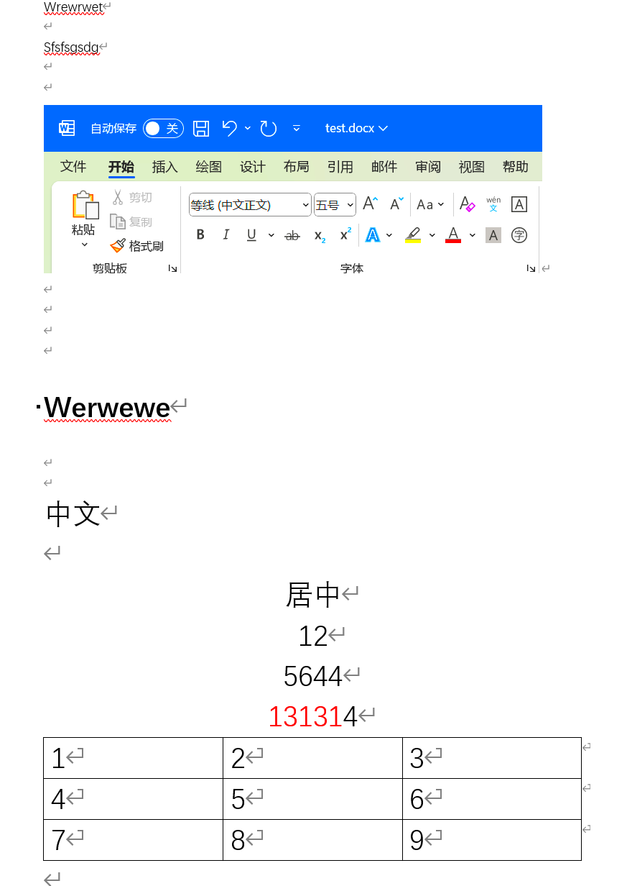


转换后：

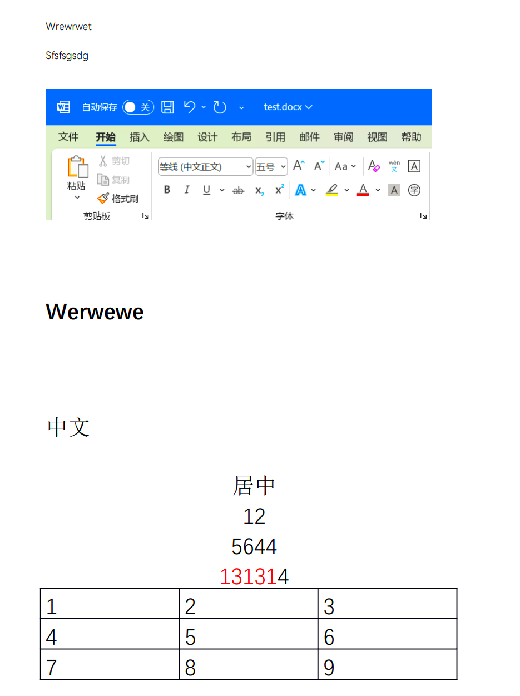


结果正确


